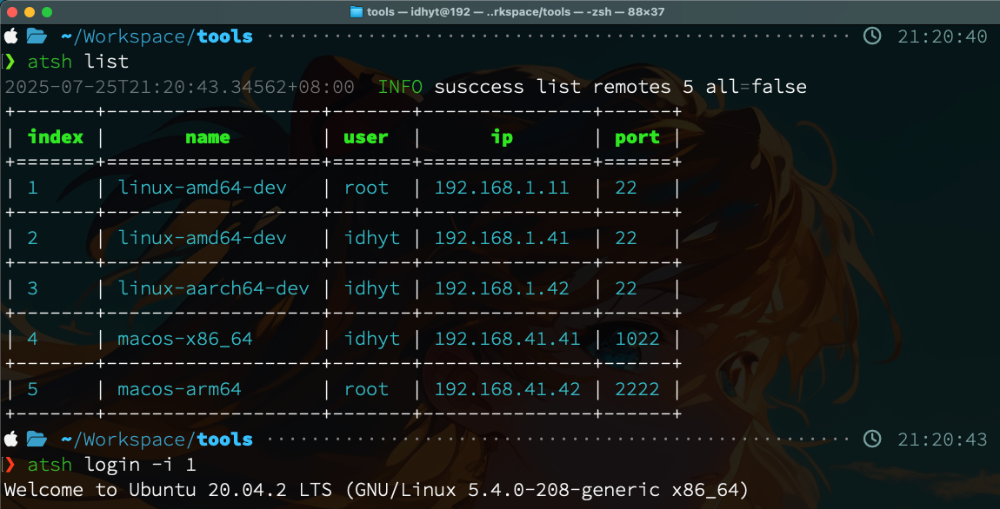
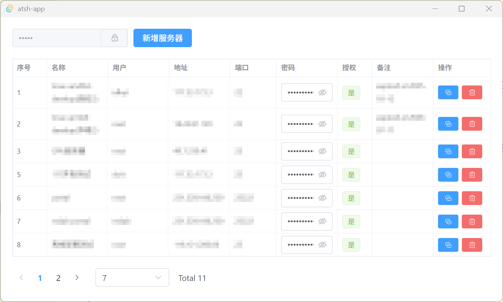

# Usage

所有数据默认保存在 `$HOME/.atsh.d`，数据迁移时候整个目录拷贝即可

```bash
╰─ tree ~/.atsh.d
~/.atsh.d
├── atsh                             # autossh.exe / atsh.exe in windows
└── .atsh.d                          # atsh data
    ├── atsh.db                      # records database
    ├── id_rsa                       # ssh private key
    ├── id_rsa.pub                   # ssh public key
    ├── config.toml                  # config file with little information
    └── logs                         # log directory
        └── 2025-07-21.json
```

命令行工具



桌面应用(demo)



## 免密登录

如果想指定登录密钥，将密钥路径写入配置文件 `config.toml` 即可

```toml
[sshkey]
private = "/home/to/.ssh/id_rsa"
public = "/home/to/.ssh/id_rsa.pub"
```

可按照如下操作使用无密码登录:

```bash
> atsh ssh-keygen
INFO 🔑 Starting generating rsa key pair...
Generating public/private rsa key pair.
Enter passphrase (empty for no passphrase):
Enter same passphrase again:
...
```

输入密码为空(回车)即可，但请妥善保护好你的私钥文件！

## Build && Install

Download the pre-built binary directly from [release](https://github.com/idhyt/autossh/releases)

OR install by cargo

```bash
cargo install atsh/autossh
```

OR build from source

```bash
git clone --depth=1 https://github.com/idhyt/autossh
cd autossh && cargo build --release
```

OR cross build for other platform

```bash
╰─ ./xbuild
1) x86_64-unknown-linux-musl
2) aarch64-unknown-linux-musl
3) x86_64-apple-darwin
4) aarch64-apple-darwin
5) x86_64-pc-windows-gnu
Select the target platform number:
```

## 命令

More details see `--help`

### add

该命令需要强制添加环境变量 `ATSH_KEY` 用于加密存储密码。

```bash
❯ atsh add -u idhyt -p password -i 1.2.3.4 -n ubuntu
+-------+--------+-------+---------+------+
| index | name   | user  | ip      | port |
+=======+========+=======+=========+======+
| 1     | ubuntu | idhyt | 1.2.3.4 | 22   |
+-------+--------+-------+---------+------+
```

add other server info by `-N/--note` option, like `-N "expired at 2022-11-11"`

note! the password need to be escaped if there are special characters in it. you can refer to the following [which-characters-need-to-be-escaped-when-using-bash](https://stackoverflow.com/questions/15783701/which-characters-need-to-be-escaped-when-using-bash)

### login

该命令仅在第一次执行时需要 `ATSH_KEY` 环境变量做认证，后续则不再需要。

```bash
❯ atsh login -i 1
(idhyt@1.2.3.4) Password:
Welcome to Ubuntu 20.04.2 LTS (GNU/Linux 5.4.0-156-generic x86_64)
```

authorize again by `--auth` option, useful when the password is changed or copied to another machine

### remove/rm/delete/del

```bash
❯ atsh rm -i 1
+-------+------+------+----+------+
| index | name | user | ip | port |
+-------+------+------+----+------+
```

remove multiple records by `rm -i 1 2 3 ...`

### list/ls/l

```bash
❯ atsh ls
+-------+--------+-------+---------+------+
| index | name   | user  | ip      | port |
+=======+========+=======+=========+======+
| 1     | ubuntu | idhyt | 1.2.3.4 | 22   |
+-------+--------+-------+---------+------+
```

```bash
❯ atsh ls --all
+-------+--------+-------+---------+------+----------+
| index | name   | user  | ip      | port | password |
+=======+========+=======+=========+======+==========+
| 1     | ubuntu | idhyt | 1.2.3.4 | 22   | password |
+-------+--------+-------+---------+------+----------+
```

### download / upload

```bash
❯ atsh upload -i 1 -p ./test.txt /tmp/test.txt
❯ atsh download -i 1 -p /tmp/test.txt ./test.txt
```

# Changelog

## 0.4.3

- 通过 `ssh-keygen` 生成密钥对
- 优化和重构部分实现

## 0.4.2

- 更新部分依赖
- 默认数据目录为 $HOME/.atsh.d

## 0.4.1

- 降级 edition 为 2021 以支持低版本
- 更新 cross 编译工具链到最新版本

## 0.4.0

- 优化和重构，将存储方式改为数据库
- 使用 `upload/download` 功能替换 `scp` 功能
- 环境变量改为 `ATSH_KEY` ( 暂时兼容 `ASKEY` )
- 编译的可执行文件从 `autossh` 改为 `atsh`

使用 [tool.py](https://github.com/idhyt/autossh/blob/main/tool.py) 可将早期版本(<=0.3.2>)的数据迁移到数据库中，请执行以下命令：

```bash
mkdir -p ~/.atsh.d
python tool.py toml2db -i ~/.config/autossh/config.toml -o ~/.atsh.d
```

## 0.3.1

- 增加 scp 功能（文件/目录）

如果`path1`存在，则认为是从本地拷贝到远程服务器`path2`，反之则是从远程服务器拷贝到本地。

## 0.3.0

- 使用标准的免密登录方式(更安全)
- 强制加密 (确保设置了 `ASKEY` 环境变量，仅认证过程需要)
- 在 win 和 unix 系统下行为保持一致性

## 0.2.0

- 部分重构
- 支持插件模块

## 0.1.2

- windows 支持
- 编译优化和提示

## 0.1.1

- 支持一次删除多个记录
- 支持增加备注信息

## 0.1.0

- 添加、删除、查看、免密登录
