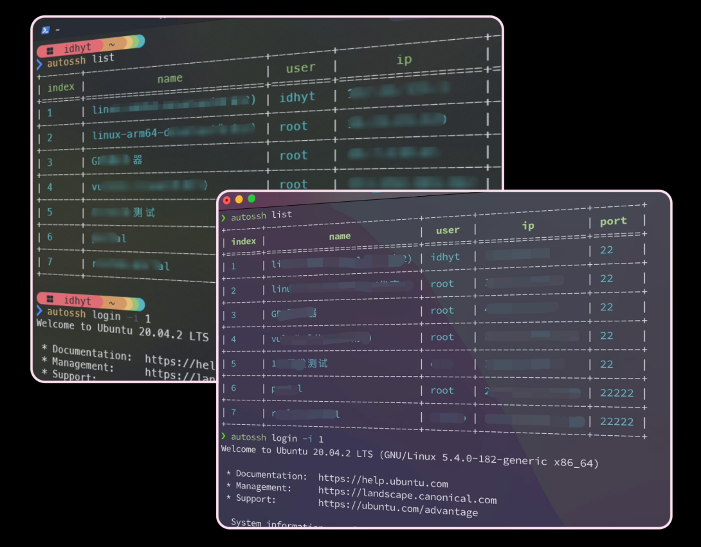

## update 0.3

- 使用标准的免密登录方式(更安全)
- 强制加密 (确保设置了 `ASKEY` 环境变量)
- 在win和unix系统下行为保持一致性

默认情况下，会使用 `$HOME/.ssh/id_rsa` 作为登录密钥，如果该密钥设置的密码，登录时需要输入该密钥设置的密码，推荐该方式。

可按照如下操作使用无密码登录:

step1. 生成无密码登录的密钥

```bash
ssh-keygen -t rsa -b 2048 -C "autossh" -N "" -f /path/to/.ssh/autossh_key
```

step2. 将密钥路径写入配置文件 `$HOME/.autossh.toml`

```toml
[sshkey]
private = "/home/idhyt/.ssh/autossh_key"
public = "/home/idhyt/.ssh/autossh_key.pub"
```

后续登录就不会需要密码了，但请妥善保护好你的私钥文件！

如果在其他机器上使用，只需要将 `private key`，`public key` 和 `.autossh.toml` 文件拷贝到其他机器即可。

## build

```bash
git clone https://github.com/idhyt/autossh
cd autossh && cargo build --release
```

## usage

```bash
❯ autossh --help
ssh manager and auto login tool

Usage: autossh [COMMAND]

Commands:
  list    List the remote server
  add     Add the remote server
  remove  Remove the remote server by index
  login   Login the remote server by index
  help    Print this message or the help of the given subcommand(s)

Options:
  -h, --help     Print help
  -V, --version  Print version
```

### add

```bash
❯ autossh add -u idhyt -p password -i 1.2.3.4 -n ubuntu
+-------+--------+-------+---------+------+
| index | name   | user  | ip      | port |
+=======+========+=======+=========+======+
| 1     | ubuntu | idhyt | 1.2.3.4 | 22   |
+-------+--------+-------+---------+------+
```

add other server info by `-N/--note` option, like `-N "expired at 2022-11-11"`

note! the password need to be escaped if there are special characters in it. you can refer to the following [which-characters-need-to-be-escaped-when-using-bash](https://stackoverflow.com/questions/15783701/which-characters-need-to-be-escaped-when-using-bash)

### remove/rm/delete/del

```bash
❯ autossh rm -i 1
+-------+------+------+----+------+
| index | name | user | ip | port |
+-------+------+------+----+------+
```

remove multiple records by `rm -i 1 2 3 ...`

### list/ls/l

```bash
❯ autossh ls
+-------+--------+-------+---------+------+
| index | name   | user  | ip      | port |
+=======+========+=======+=========+======+
| 1     | ubuntu | idhyt | 1.2.3.4 | 22   |
+-------+--------+-------+---------+------+
```

maybe `scp` something, add option parameter `-a/--all` to show password.

```bash
❯ autossh ls --all
+-------+--------+-------+---------+------+----------+
| index | name   | user  | ip      | port | password |
+=======+========+=======+=========+======+==========+
| 1     | ubuntu | idhyt | 1.2.3.4 | 22   | password |
+-------+--------+-------+---------+------+----------+
```

### login

```bash
❯ autossh login -i 1
(idhyt@1.2.3.4) Password:
Welcome to Ubuntu 20.04.2 LTS (GNU/Linux 5.4.0-156-generic x86_64)
```

authorize again by `--auth` option, useful when the password is changed or copied to another machine

### backup or restore

the record file is location `$HOME/.autossh.toml`, you can change and backup it manually.

~~## 💥 security 💥~~

the `password` fields is plaintext by default,

if you wish to encrypt it, import environment variables `ASKEY` before use.

`export ASKEY="SecretKey"` in bash, 

`set ASKEY="SecretKey"` in cmd and 

`$env:ASKEY="SecretKey"` in powershell.

```bash
❯ export ASKEY="protected"
❯ autossh add -u idhyt -p password -i 1.2.3.4 -n ubuntu
> autossh list --all
+-------+--------+-------+---------+------+----------+
| index | name   | user  | ip      | port | password |
+=======+========+=======+=========+======+==========+
| 1     | ubuntu | idhyt | 1.2.3.4 | 22   | password |
+-------+--------+-------+---------+------+----------+
❯ cat ~/.autossh.toml | grep password
password = "IiaMr0ce4iKF5AvXf+rtFQ9mET0Ug4hLOoGeybzyOQx/lUvh"
```

~~## plugins / command~~

This is an experimental feature and may be refactored frequently.

the variables in the symbol `{}` will be [formatted](src/cmd/plugin.rs#L102) as server information. do not change the variable name.

here a auto login ssh with password and run ps command by `passh` in linux:

```bash
❯ autossh plugin add -n "ps" -p "passh" -c "{PLUGIN} -p '{PASSWORD}' ssh -p {PORT} {USER}@{IP} ps -a"
+--------+---------------+-----------------------------------------------------------------+
|  name  |     path      |                             command                             |
+========+===============+=================================================================+
| ps     |     passh     | {PLUGIN} -p '{PASSWORD}' ssh -p {PORT} {USER}@{IP} ps -a        |
+--------+---------------+-----------------------------------------------------------------+

❯ autossh plugin run -n "ps" -i 1
[2024-06-25T08:37:29Z INFO  autossh::cmd::plugin] run command output:
(idhyt@1.2.3.4) Password:
        PID TTY          TIME CMD
       3588 pts/1    00:00:00 zsh
       3590 pts/1    00:00:05 zsh
       ...
```

example in windows, use `putty` to auto login ssh with password:

```bash
D:\Downloads\autossh>autossh.exe plugin add -n "login" -p "D:\Downloads\autossh\putty.exe" -c "{PLUGIN} -ssh {USER}@{IP} -P {PORT} -pw {PASSWORD}"
+-------+--------------------------------+----------------------------------------------------+
| name  |              path              |                      command                       |
+=======+================================+====================================================+
| login | D:\Downloads\autossh\putty.exe | {PLUGIN} -ssh {USER}@{IP} -P {PORT} -pw {PASSWORD} |
+-------+--------------------------------+----------------------------------------------------+

D:\Downloads\autossh>autossh.exe plugin run -i 1 -n "login"
... you will see the login window ...
```

