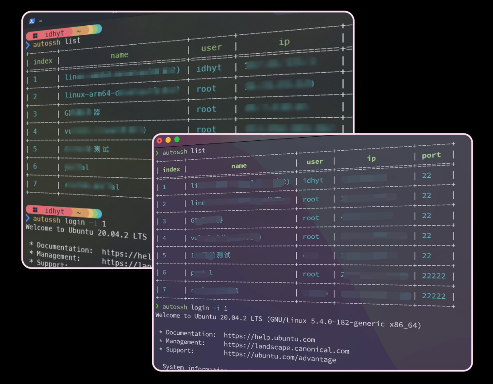

# Usage

数据迁移时候整个目录拷贝即可

```bash
╰─ tree ~/.atsh.d
~/.atsh.d
├── atsh                             # autossh.exe / atsh.exe in windows
└── .atsh.d                          # atsh data
    ├── atsh.db                      # records database
    ├── id_rsa                       # ssh private key
    ├── id_rsa.pub                   # ssh public key
    ├── config.toml                  # config file with little information
    └── logs                         # log directory
        └── 2025-07-21.json
```

免密登录、数据迁移、本地构建等参考文档 [README.md](https://github.com/idhyt/autossh/blob/main/README.md)
